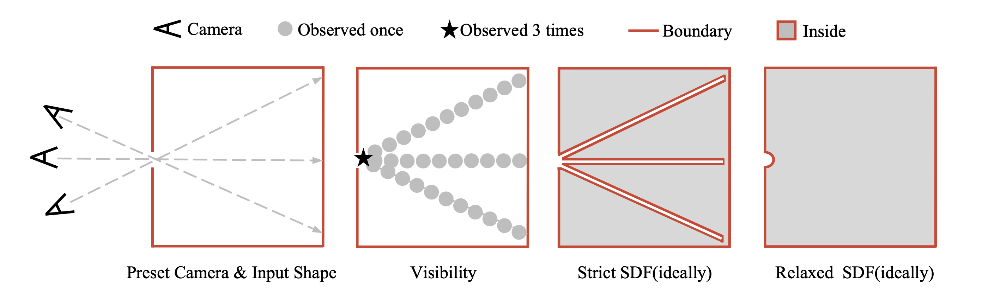

<p align="left">
        <a href="README_CN.md">中文</a> &nbsp｜ &nbsp English&nbsp&nbsp 
</p>
<p align="center">
    <picture>
    
    </picture>
    </br>
    <b>Mesh to Relaxed SDF</b>
</p>

## 📘 Introduction

This repository aims to convert meshes into watertight models using a **R**elaxed **SDF** (Signed Distance Field) method. 

### ❓What is Relaxed SDF?

Relaxed SDF is an approach that represents 3D shapes using signed distance fields with more flexible constraints than traditional SDFs.
This method is particularly effective for handling imperfect meshes with issues such as non-watertight mesh with holes. In simple terms, we use a predefined camera and a grid-based visibility method to determine the sign, and relax the strict requirement for distinguishing between inside and outside during the judgment process. More details can be found in [Algorithm](#-algorithm-our-remeshing-method).
<p align="center">
    <picture>
    
    </picture>
    </br>
</p>

### ✨ Key Features
- Determines Sign using Grid-Based Visibility
- Mitigates artifacts caused by the Strict Sign determination criteria used in the previous method
- Supports multi-threaded and multi-GPU parallel processing


### 💧Why Watertight Models?

Most existing native 3D generation models use SDF as their geometric representation method, which requires preprocessing to ensure watertight meshes. An appropriate watertightness method can accelerate the convergence of ShapeVAE models and enhance their representational capability.


## 📐 Algorithm: Our remeshing method
<!-- **Algorithm: Our remeshing method** -->

**Input:** Input Triangles normalized in [-1,1]  
**Output:** Output watertight Mesh

1. Initialize `SDF` as a 3D array of dimensions 512 × 512 × 512  
2. Initialize `SDF` default value to `+∞`  
3. For each triangle `M` in Triangles:  
    a. For each grid point `(i,j,k)` within T's bounding box:  
        - Update the UDF value and store in `SDF[i,j,k]`
4. Preset `N` virtual cameras.
5. Calculate grid-based visibility for each grid point using `SDF`  
6. For each grid point `(i,j,k)` in all grid points:  
    ~~(Strict SDF) If grid point `(i,j,k)` is not visible from **any** direction:~~  
    (**Relaxed SDF**) If grid point `(i,j,k)` observed fewer than `T` times:  
        - Set `SDF[i,j,k] ← 0`  
7. Return Mesh ← `marchingcubes(SDF, 2/512)`


## 🛠️ Usage

### Install

```bash
git clone https://github.com/wqdong8/mesh_to_relaxed_sdf

cd mesh_to_relaxed_sdf
pip install -r requirements.txt 
```

### To watertight mesh

```python
python to_watertight_mesh.py --mesh_path examples/chair.obj --mesh_id chair --save_dir RSDF_datasets/watertight --resolution 512 --scale 1.0
```

<details> <summary>Others</summary>

```python
# To watertight mesh use Strict DF
python to_watertight_mesh.py --mesh_path examples/chair.obj --mesh_id chair --save_dir RSDF_datasets/watertight --resolution 512 --scale 1.0 --use_strict
```
</details>

### Data sample(for ShapeVAE)
```python
python mesh_sample.py --mesh_path RSDF_datasets/watertight/chair.obj --mesh_id chair --point_number 200000 --save_dir RSDF_datasets/samples/chair --num_split 1
```

### 📁 Distributed process
**Data format**

The input data information should be stored in a JSON file. The file must contain a list of items, where each item is a list with the following two elements: [Example](examples/example_data_info.json)

```json
[
  ["path/to/mesh1.obj", "mesh_name_1"],
  ["path/to/mesh2.obj", "mesh_name_2"],
  ...
]
```
Then you can use this script:
```python
# Single-GPU Single-process
python distributed_process.py --input_models_info examples/example_data_info.json --save_dir RSDF_datasets --num_gpus 1 --workers_per_gpu 1 --gpu_list 0 --save_watertight_mesh --end_i -1 --remesh_resolution 512

# Multi-GPU Multi-process
python distributed_process.py --input_models_info path/to/your/data_info.json --save_dir RSDF_datasets --num_gpus 8 --workers_per_gpu 4 --gpu_list 0 1 2 3 4 5 6 7 --save_watertight_mesh --end_i -1 --remesh_resolution 512
```

## 📧 Contact

If you have any further questions, please feel free to contact [Wenqi Dong](mailto:wqdong98@gmail.com) ([@wqdong8](https://github.com/wqdong8)).

## ⭐Acknowledgements

We would like to thank the following projects and papers: [mesh_to_sdf](https://github.com/marian42/mesh_to_sdf), [mesh2sdf](https://github.com/wang-ps/mesh2sdf), [cubvh](https://github.com/ashawkey/cubvh), [CuMCubes](https://github.com/lzhnb/CuMCubes), [3DShape2VecSet](https://github.com/1zb/3DShape2VecSet), [Wonder3D](https://github.com/xxlong0/Wonder3D), [Michelangelo](https://github.com/NeuralCarver/Michelangelo), [CLAY](https://github.com/CLAY-3D/OpenCLAY), [CraftsMan3D](https://github.com/wyysf-98/CraftsMan3D), [Dora3D](https://github.com/Seed3D/Dora), [Hunyuan3D](https://github.com/Tencent/Hunyuan3D-2), [TripoSG](https://github.com/VAST-AI-Research/TripoSG). The grid-based visibility method used in this project was originally proposed by [CLAY](https://github.com/CLAY-3D/OpenCLAY). Parts of the implementation are adapted from the [mesh_to_sdf](https://github.com/marian42/mesh_to_sdf), [Dora3D](https://github.com/Seed3D/Dora) and [Wonder3D](https://github.com/xxlong0/Wonder3D) projects.