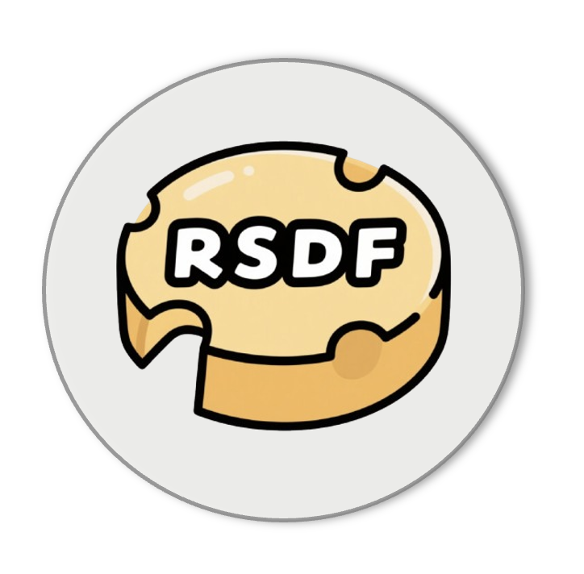
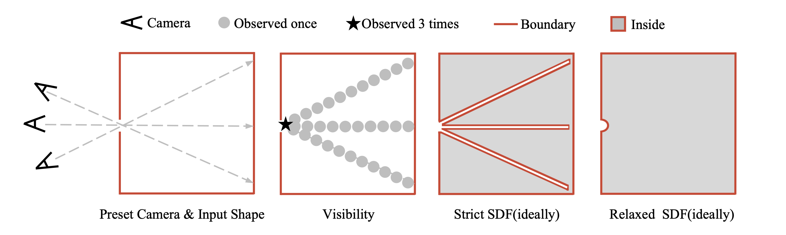

<p align="left">
        中文 &nbsp｜ &nbsp<a href="README.md">English</a>&nbsp&nbsp 
</p>
<p align="center">
    <picture>
    
    </picture>
    </br>
    <b>网格到松弛型SDF转换</b>
</p>

## 📘 简介

本仓库旨在使用**松弛型SDF**（有符号距离场）方法将网格转换为水密模型。

### ❓什么是松弛型SDF？

松弛型SDF是一种使用比传统SDF更灵活约束的有符号距离场来表示3D形状的方法。
这种方法对于处理有问题的非水密网格（如有孔洞的网格）特别有效。简单来说，我们使用预定义的相机和基于网格的可见性方法来确定符号，并在判断过程中放宽了区分内部和外部的严格要求。更多详细信息可以在[算法](#-算法我们的重新网格化方法)部分找到。
<p align="center">
    <picture>
    
    </picture>
    </br>
</p>

### ✨ 主要特点
- 使用基于网格的可见性确定符号
- 减轻由先前方法中使用的严格符号确定标准引起的伪影
- 支持多线程和多GPU并行处理


### 💧为什么需要水密模型？

大多数现有的原生3D生成模型使用SDF作为几何表示方法，这需要预处理以确保水密网格。适当的水密性方法可以加速ShapeVAE模型的收敛并增强其表示能力。


## 📐 算法：我们的重新网格化方法
<!-- **算法：我们的重新网格化方法** -->

**输入：** 在[-1,1]范围内归一化的输入三角形  
**输出：** 水密网格输出

1. 初始化`SDF`为尺寸为512 × 512 × 512的3D数组  
2. 初始化`SDF`默认值为`+∞`  
3. 对于三角形集合中的每个三角形`M`：  
    a. 对于T的包围盒内的每个网格点`(i,j,k)`：  
        - 更新UDF值并存储在`SDF[i,j,k]`中
4. 预设`N`个虚拟相机。
5. 使用`SDF`计算每个网格点的基于网格的可见性  
6. 对于所有网格点中的每个网格点`(i,j,k)`：  
    ~~（严格SDF）如果网格点`(i,j,k)`从**任何**方向都不可见：~~  
    （**松弛型SDF**）如果网格点`(i,j,k)`被观察到的次数少于`T`次：  
        - 设置`SDF[i,j,k] ← 0`  
7. 返回网格 ← `marchingcubes(SDF, 2/512)`


## 🛠️ 使用方法

### 安装

```bash
git clone https://github.com/wqdong8/mesh_to_relaxed_sdf

cd mesh_to_relaxed_sdf
pip install -r requirements.txt 
```

### 转换为水密网格

```python
python to_watertight_mesh.py --mesh_path examples/chair.obj --mesh_id chair --save_dir RSDF_datasets/watertight --resolution 512 --scale 1.0
```

<details> <summary>其他选项</summary>

```python
# 使用严格DF转换为水密网格
python to_watertight_mesh.py --mesh_path examples/chair.obj --mesh_id chair --save_dir RSDF_datasets/watertight --resolution 512 --scale 1.0 --use_strict
```
</details>

### 数据采样（用于ShapeVAE）
```python
python mesh_sample.py --mesh_path RSDF_datasets/watertight/chair.obj --mesh_id chair --point_number 200000 --save_dir RSDF_datasets/samples/chair --num_split 1
```

### 📁 分布式处理
**数据格式**

输入数据信息应存储在JSON文件中。该文件必须包含一个项目列表，其中每个项目是一个包含以下两个元素的列表：[示例](examples/example_data_info.json)

```json
[
  ["path/to/mesh1.obj", "mesh_name_1"],
  ["path/to/mesh2.obj", "mesh_name_2"],
  ...
]
```
然后你可以使用这个脚本：
```python
# 单GPU单进程
python distributed_process.py --input_models_info examples/example_data_info.json --save_dir RSDF_datasets --num_gpus 1 --workers_per_gpu 1 --gpu_list 0 --save_watertight_mesh --end_i -1 --remesh_resolution 512

# 多GPU多进程
python distributed_process.py --input_models_info path/to/your/data_info.json --save_dir RSDF_datasets --num_gpus 8 --workers_per_gpu 4 --gpu_list 0 1 2 3 4 5 6 7 --save_watertight_mesh --end_i -1 --remesh_resolution 512
```

## 📧 联系方式

如有任何疑问，欢迎联系 [董文琦](mailto:wqdong98@gmail.com)（[@wqdong8](https://github.com/wqdong8)）。

## ⭐致谢

我们要感谢以下项目和论文：[mesh_to_sdf](https://github.com/marian42/mesh_to_sdf)、[mesh2sdf](https://github.com/wang-ps/mesh2sdf)、[cubvh](https://github.com/ashawkey/cubvh)、[CuMCubes](https://github.com/lzhnb/CuMCubes)、[3DShape2VecSet](https://github.com/1zb/3DShape2VecSet)、[Wonder3D](https://github.com/xxlong0/Wonder3D)、[Michelangelo](https://github.com/NeuralCarver/Michelangelo)、[CLAY](https://github.com/CLAY-3D/OpenCLAY)、[CraftsMan3D](https://github.com/wyysf-98/CraftsMan3D)、[Dora3D](https://github.com/Seed3D/Dora)、[Hunyuan3D](https://github.com/Tencent/Hunyuan3D-2)、[TripoSG](https://github.com/VAST-AI-Research/TripoSG)。本项目中使用的基于网格的可见性方法最初由 [CLAY](https://github.com/CLAY-3D/OpenCLAY) 提出。部分实现借鉴自 [mesh_to_sdf](https://github.com/marian42/mesh_to_sdf)、[Dora3D](https://github.com/Seed3D/Dora) 和 [Wonder3D](https://github.com/xxlong0/Wonder3D) 项目。